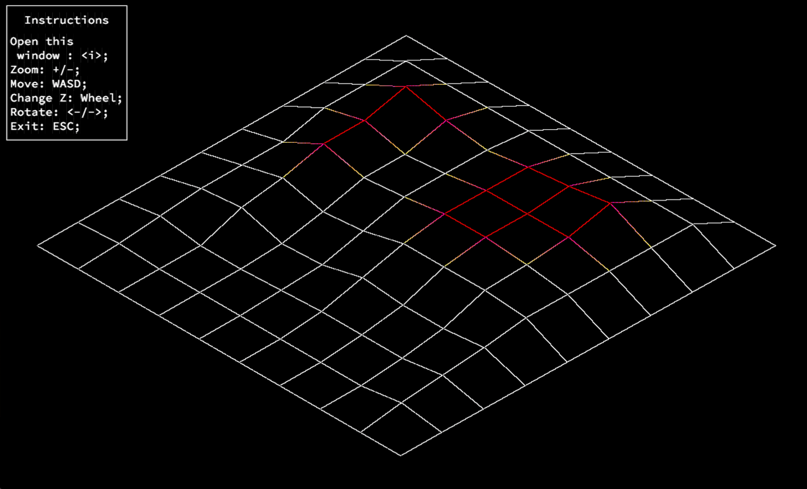

# FdF - Wireframe creation using MiniLibX

For this project, we had to create an isometric projection of a map of coordinates. To do so, we had access to a graphical library created
for 42 students: the **MiniLibX**. To understand how to install it and use it for your own projects, please check the following link:
https://harm-smits.github.io/42docs/libs/minilibx.

The maps (see test_maps directory for all of them) are all similar to this:

```
0  0  0  0  0  0  0  0  0  0
0 10 10 10 10 10 10 10 10  0
0 10 20,0xFF0000 15,0xFF0000 12 15,0xFF0000 17,0xFF0000 20,0xFF0000 10  0
0 10 15,0xFF0000 10 12 15,0xFF0000 15,0xFF0000 15,0xFF0000 10  0
0  5 15,0xFF0000 10 12 15,0xFF0000 15,0xFF0000 13 10  0
0  5 10  5  7 12 12 12 10  0
0  5  7  1  2  7  5  5  7  0
0  3  0  0  1  2  2  2  5  0
0  1  0  0  0  0  0  0  3  0
0  0  0  0  0  0  0  0  0  0
```

The x-axis is given by the number of coordinates in each line, the y-axis by the number of lines and the z-axis by the value of each coordinate.
Optionally, the coordinates can have a color value given in hexadecimals in front of the z-axis value. This should be implemented as the color
that that coordinate will have. From this map, the result will be the following:



As you can see, instructions about interactions you can have with the image are displayed at the start of the program and it is possible to recall
them by pressing **i**.

## How to use it

After cloning the repository, run the following commands:

```
cd FdF
make
./FdF test_maps/[map].fdf
```

Replace [map] by any of the maps existing in the *test_maps* directory. Have fun!
